# hyeonworld

  <a href="https://github.com/hyeonwoody/hyeonworld/wiki/Welcome-to-Hyeonworld!">🌐 위키</a>
  &nbsp; | &nbsp; 
  <a href="https://github.com/users/hyeonwoody/projects/3">🗃️ 백로그</a>
  &nbsp; | &nbsp;
  <a href="https://github.com/hyeonwoody/hyeonworld/wiki/Welcome-to-Hyeonworld!#%EC%84%9C%EB%B9%84%EC%8A%A4-%EC%86%8C%EA%B0%9C">🔍 소개</a>
  &nbsp; | &nbsp;
  <a href="https://github.com/hyeonwoody/hyeonworld/wiki/JPA-to-JDBC-Migration">🛠️ 개발</a>

 

## 🧑‍💻: Intro
>Family Recreation Game Collection: Fostering Family Unity.

**❓Problem**: Lack of engaging activities for families reuniting during holidays.  
**❗Idea**: Create icebreaker games to bring all family members closer together.  
**💯Solution**: Web-based recreational games enjoyable for all generations.  

 

## 🧱: Structure

 

## 🛢️: Entity Relationship Diagram
[Wiki Documentation](https://github.com/hyeonwoody/hyeonworld/wiki/Entity-Relationship-Diagram)

```mermaid
erDiagram
    user{
        bigint id PK "User ID"
        bool login PK "Login status"
        string(20) name PK "Name"
        int relation PK "Family relation degree"
        int party_type PK "Family relationship type"
        string email "Email"
        bool proposition "Name particle 0: 은/이, 1: 는/가"
        string nick_name "Nickname"
        bool nick_name_proposition "Nickname particle"
        bool in_game "In-game status"
    }
    party{
        bigint id PK "Party ID"
        int party_type "Family relationship type"
        datetime created_at "Creation time"
    }
    party_dashboard{
        bigint party_id FK "Party ID"
        bigint current_game_id FK "Current game"
        int current_game_stage "Current game stage"
    }
    game{
        bigint id PK "Game ID"
        string name "Game name"
        string description "Game description"
        bool playable "Playable status"
    }
    round{
        bigint party_id FK "Party ID"
        bigint id PK "Round ID"
        bigint game_id FK "Game ID"
        int answer "Answer"
        datetime created_at "Creation time"
    }
    submission{
        bigint id PK "Submission ID"
        bigint round_id FK "Round ID"
        bigint user_id FK "User ID"
        bigint number "Number"
        string text "Text"
    }
    score{
        bigint party_id FK "Party ID composite key"
        bigint user_id FK "User ID composite key"
        bigint score "Total score"
    }
    score_history{
        bigint user_id FK "User ID"
        bigint party_id FK "Party ID"
        bigint round_id FK "Round ID"
        bigint score "Round score"
    }
    party ||--|| party_dashboard : contains
    party_dashboard ||--|| game : "tracks current"
    party ||--o{ round : includes
    user ||--o{ submission : submits
    round ||--o{ submission : "is associated with"
    round ||--o{ score_history : generates
    score ||--o{ score_history : "is detailed in"

    game ||--|| round : "plays in"
```

 

## 🗓️: Development Period
From August 2022 to September 2024, developed by one person.  
Continuously undergoing updates.

 

## ✅: Implementation
- **Proxy**: Configure a proxy to access the server.  
- **Firewall**: Set the `disableFirewall` option to true in `webpackDevServer.config.js`.  
- **Port Forwarding**: Configure the router to allow access from external networks.  
- **CORS Configuration**: Utilize `WebMvcConfigurer`.  
- **SSE (Server-Sent Events)**: Establish an EventSource connection with the server when a player enters the game. The server manages connections using an `SseEmitter` list.  
- **Login**: Allow login by comparing the entered name with a list of family member nameDtos stored in a database.  
- **Member CRUD**: Provide an admin menu to add users.  

 

### Users are defined as  :
| Term        | Description                                       | Note                                     |
|-------------|---------------------------------------------------|------------------------------------------|
| Moderator   | The user who officiates the game.                 |                                          |
| Monitor     | A display board showing the progress of the game. |                                          |
| Participant | Users participating in the game.                  | Divided into maternal and paternal sides |

 

### Moderator menu :
| **Menu** |                                               **Description**                                                | **Note** |
|:--------:|:------------------------------------------------------------------------------------------------------------:|:--------:|
|   Init   | Moderator menu. Set whether playing with maternal/paternal side, set number of participants, activate login. |          |
|   Open   |                                                  Initialize the game to be played.                                                 |          |
|   Done   |                                         End the game and control all participants to move to the home screen.                                        |         |  

 

### Game stages :
| **Stage** |            **Description**            | **Note** |
|:---------:|:-------------------------------------:|:-------:|
| Tutorial  |    The phase explaining each game.    |         |
|  Submit   |             The phase where participants submit their entries.             |         |
|   Check   |      The phase where the moderator checks the content submitted by participants.       |         |
|   Show    | The phase where the content selected by the moderator is revealed to all participants and monitor devices. |         |
|   Play    |     The phase where participants play the game based on the revealed content.     |         |
|  Result   |           	The phase where the results of the game are revealed.            |         |
|  Ranking  |        	The phase showing the current score rankings of participants.        |         |

 

### Moderator Control and Game Flow:
1. The moderator has the ability to change stages.
2. UI changes are applied to all participants when the stage changes.
3. The moderator can end (Done) a game after at least one round, based on their judgment.
4. At the end of each round, a score_source Entity is created to record the game content and scores.

 

## 🎥: Demonstration

[Link to AWS EC2](http://13.125.105.200:13001/)
(AdminId : 가족 ) 

 

## 📞: Contact
- Email: hyeonwoody@gmail.com
- Blog: https://velog.io/@hyeonwoody
- Github: https://github.com/hyeonwoody

 

## 🧱: Technologies Used
> Java (Spring Boot)
> 
> Javascript (react.js)

 

## 📚: Libraries Used
> Tailwind CSS  
> 
> JDBC (MariaDB)  
> 
> EventSource & SseEmitter
> 
> axios (Moderator <=> Server <=> Participants) 
> 
> React Hook [useState (game stage)]

 

## 🔥: Accomplishments
> [JPA to JDBC migration](https://github.com/hyeonwoody/hyeonworld/wiki/JPA-to-JDBC-Migration)   
> [Improving Package Structure](https://github.com/hyeonwoody/hyeonworld/wiki/JPA-to-JDBC-Migration)

 

## 🌐: Wiki
[hyeonworld Wiki](https://github.com/hyeonwoody/hyeonworld/wiki)

  
